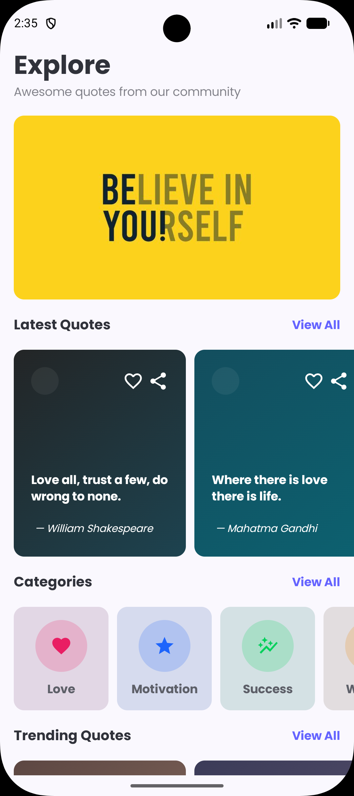
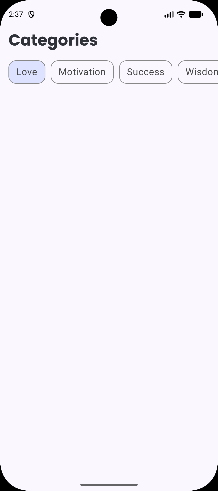

# Quotify 📖

**Quotify** is a modern, visually appealing Android application built with Jetpack Compose. It serves as a discovery platform for inspiring quotes, featuring a sleek UI with dynamic gradients, custom typography, and smooth navigation.

> [!NOTE]
> This project is currently a **Work in Progress**. Core UI and navigation are implemented, while data persistence and specific screens are under active development.

## 🚀 Features (Implemented)

- **Quote Discovery:** Browse a curated list of latest and trending quotes on the Home screen.
- **Visual Aesthetic:** Beautifully designed quote cards with unique linear gradients and Material Design 3 components.
- **Custom Typography:** Integrated **Poppins** font family for a premium reading experience.
- **Modern Image Loading:** Efficient asynchronous image fetching using **Coil 3**.
- **Edge-to-Edge Experience:** Fully immersive UI utilizing the entire screen real estate.
- **Navigation:** Basic infrastructure using **Jetpack Navigation Component**.

## 🛠 Tech Stack

- **Language:** [Kotlin](https://kotlinlang.org/)
- **UI Framework:** [Jetpack Compose](https://developer.android.com/jetpack/compose)
- **Navigation:** [Jetpack Navigation Component](https://developer.android.com/guide/navigation)
- **Image Loading:** [Coil 3](https://coil-kt.github.io/coil/)
- **Design System:** [Material Design 3](https://m3.material.io/)
- **Dependency Management:** Gradle Kotlin DSL

## 📂 Project Structure

```text
com.example.quotify
├── data                # Data models and repositories (Quotes, Categories)
├── presentation        # UI Layer
│   ├── components      # Reusable UI widgets (Cards, Spacers, Headers)
│   ├── navigation      # Navigation routes and graph
│   └── screens         # Individual screen composables (Home, Explore)
├── ui.theme            # Custom Material3 theme and typography
└── MainActivity.kt     # Entry point of the application
```

## 📸 Screenshots

<div align="center">
  
  
</div>

## 🗺️ Roadmap (Upcoming Features)

- [ ] **Explore Screen:** Implementation of category-based quote filtering.
- [ ] **Saved Screen:** A dedicated space for users to view their bookmarked quotes.
- [ ] **Local Persistence:** Integration of **Room Database** for saving quotes offline.
- [ ] **Sharing:** Ability to export quote cards as images or text.

## 🏁 Getting Started

1. **Clone the repository:**
   ```bash
   git clone https://github.com/lakshya263/Quotify.git
   ```
2. **Open in Android Studio:**
   Import the project and wait for Gradle sync to complete.
3. **Run the app:**
   Select an emulator or physical device and press **Run**.

## 🤝 Contributing

Contributions are welcome! If you have suggestions or want to add new features, feel free to fork the repository and create a pull request.

---
Developed by [Lakshya Srivastava](https://github.com/lakshya263)
